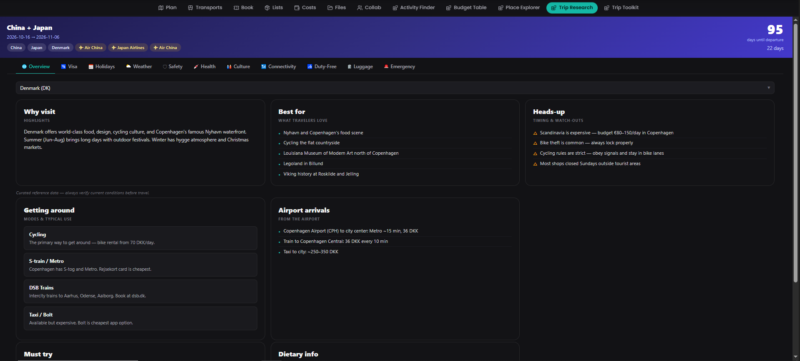

# Trip Research

An all-in-one trip-page tab that auto-populates from your trip's dates and
detected destinations: visa requirements, public holidays, weather,
a curated destination briefing (safety, health, culture,
connectivity), duty-free allowances, group luggage limits, and local
emergency numbers.

## What it does

The plugin adds a **Trip Research** tab to every trip, with a hero strip
showing a countdown and clickable destination/airline pills, followed by
twelve sub-tabs:

- **🌐 Overview / 💉 Health / 📶 Connectivity** — a curated reference briefing
  per destination (vaccines, tap water, eSIM info, transport, food). This is
  **static hand-curated data bundled with the plugin**, not an AI or live API
  call — see `server/destinations.js` for the current country list and
  sources. Health also shows a **live advisory and customs summary** fetched
  from traveldoc.aero for every country, curated or not. Connectivity's
  voltage/plug-type/frequency is overridden by `server/electric-plugs.js`
  (manually populated from the IEC world-plugs data) when a country has an
  entry there, and plug shapes are drawn as inline SVG icons (IEC's own plug
  images sit behind a bot-challenge that blocks the plugin's sandboxed iframe).
- **🛡 Safety** — the curated advisory/crime-index summary, plus a **live
  natural-hazards panel** fetched from GDACS (Global Disaster Alert and
  Coordination System) showing current active events (earthquakes, floods,
  cyclones, wildfires) affecting the destination country.
- **🎎 Culture** — useful phrases stay curated (`server/destinations.js`), but
  etiquette/respect notes and tipping norms are fetched **live from
  Wikivoyage** (the destination country's "Respect" and "Tipping" wiki
  sections, stripped of markup into plain prose/bullets server-side).
- **🛂 Visa** — visa requirements for any passport/destination pair, sourced
  from the `ilyankou/passport-index-dataset` (MIT-licensed) fetched from
  GitHub and cached for 24h, cross-checked against a **live second opinion**
  from the Henley Passport Index API (flagged when the two disagree), plus
  live "Get in" entry-requirement notes pulled from the destination's
  Wikivoyage article. Filter by visa category.
- **📅 Holidays** — public holidays for any country during your trip dates,
  via Nager.Date (free, no key required).
- **⛅ Weather** — forecast (or historical, for past dates) for a destination
  city via Open-Meteo, geocoded with Nominatim.
- **🛃 Duty-Free** — reference customs allowances (alcohol, tobacco, goods,
  cash) for the trip's countries, auto-populated but editable, stored per
  trip, backed by a **live "Free to Import" breakdown** (by category, and by
  traveller-origin context for EU/US-style split rules) fetched from
  traveldoc.aero's customs pages for every country — not just the curated set.
- **🧳 Luggage** — per-traveler carry-on/checked baggage limits by airline,
  with airlines auto-detected from flight reservations (matched against the
  OpenFlights dataset) and a searchable airline picker for manual entries.
  Shows the strictest group limit across all added travelers.
- **🚨 Emergency** — local police/fire/ambulance numbers for the trip's
  detected countries, curated for common destinations with a **live fallback**
  (from an open emergency-numbers dataset) covering every other country.

Destinations, trip dates, and airlines are auto-detected from the trip's
reservations and places where possible; every tab also supports manual
entry when auto-detection has nothing to go on.

## Screenshots

## Permissions

| Permission | Why |
|---|---|
| `db:meta` | Persists per-trip duty-free country selections and luggage entries. |
| `db:read:trips` | Reads trip dates, places, and reservations to auto-detect destinations, dates, and airlines. |
| `http:outbound:raw.githubusercontent.com` | Visa requirements (`passport-index-dataset`) and the OpenFlights airline dataset. |
| `http:outbound:date.nager.at` | Public holidays (Nager.Date, free, no key). |
| `http:outbound:api.open-meteo.com` | Weather forecasts. |
| `http:outbound:archive-api.open-meteo.com` | Historical weather for trip dates already in the past. |
| `http:outbound:nominatim.openstreetmap.org` | Geocodes city names to coordinates for weather, and reverse-geocodes coordinates to countries for destination detection. |
| `http:outbound:www.gdacs.org` | Live current natural-hazard alerts (GDACS) shown on the Safety tab. |
| `http:outbound:en.wikivoyage.org` | Live etiquette/tipping text (Wikivoyage "Respect" section) shown on the Culture tab, plus live visa "Get in" notes on the Visa tab. |
| `http:outbound:infopages.traveldoc.aero` | Live health advisory and customs/import-allowance data (including the "Free to Import" breakdown) shown on the Health and Duty-Free tabs. |
| `http:outbound:api.henleypassportindex.com` | Second-opinion visa-category data cross-checked against the primary passport-index dataset on the Visa tab. |
| `http:outbound:gist.githubusercontent.com` | Live emergency telephone numbers (police/fire/ambulance) for countries outside the plugin's curated list, shown on the Emergency tab. |
| `rates:read` | Reads TREK currency rates when normalizing and displaying money values in the trip currency. |

## Setup

Install and activate, then open a trip and select the **Trip Research**
tab. Destinations, dates, and airlines pre-fill automatically where the
trip has enough data (places with coordinates, or flight reservations with
airport/airline metadata); everything can also be entered manually.
